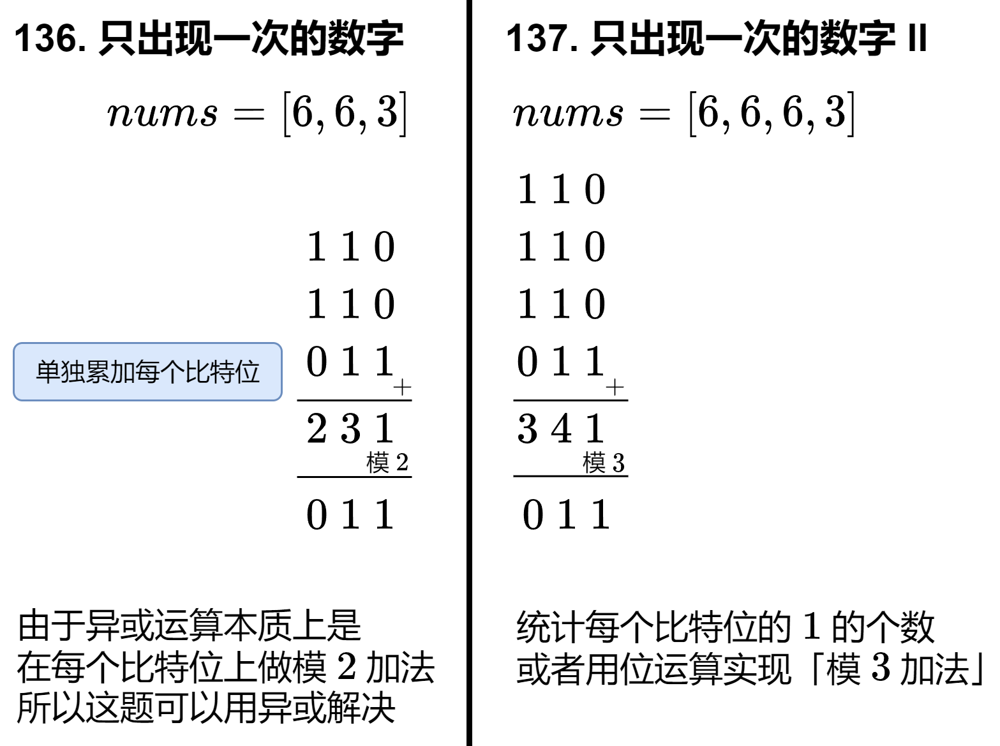

问题描述：
给你一个 非空 整数数组 nums ，除了某个元素只出现一次以外，其余每个元素均出现两次。找出那个只出现了一次的元素。
要求：time：O（n），space：（1）

SOLUTION：
~~~
class Solution {
public:
    int singleNumber(vector<int>& nums) {
        // time: O(n) space: O(1)
        int result {0};
        for (int& i : nums) {
            result ^= i;
        }
        return result;
    }
};
~~~

解析：
异或的两个性质
1. 对于任意整数 a 有 a⊕a=0 
2. a⊕0=a

## 137. 只出现一次的数字 II
问题描述：
给你一个整数数组 nums ，除某个元素仅出现 一次 外，其余每个元素都恰出现 三次 。请你找出并返回那个只出现了一次的元素。

你必须设计并实现线性时间复杂度的算法且使用常数级空间来解决此问题。

SOLUTION：
~~~

~~~

解析：

https://leetcode.cn/problems/single-number-ii/solutions/2482832/dai-ni-yi-bu-bu-tui-dao-chu-wei-yun-suan-wnwy/
