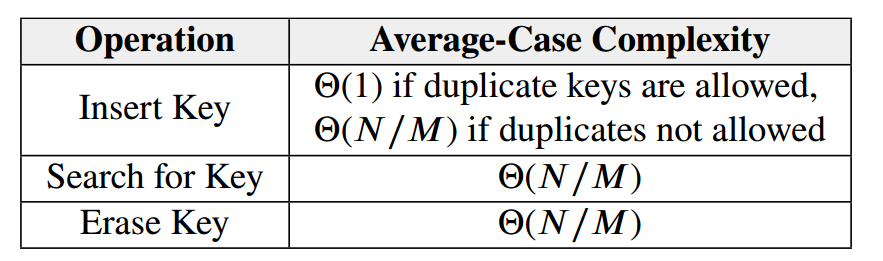

# 15 Hash
## Hashing Definition
* Translation: converts a search key into an integer
* Compression: limits an integer to a valid index
* Collision resolution: resolves search keys that hash to same table index

## Hash Function
A hash function combines translation and compression:
h(key) ⇒ c(t(key)) ⇒ table index

Note:  std::hash<> provides only translation, not compression

## Collision Resolution Techniques

* Separate Chaining
With separate chaining, each index of the hash table stores a linked list that holds all the keys that hash to that index. That is, index 0 would store a list of all items that hashed to index 0, index 1 would store a list of all items that hashed to index 1, and so on.

* Linear Probing
