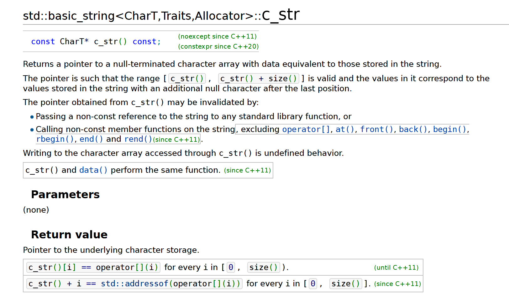

# 项目解析

声明一个Webserver Object 干了那些事？
调用Webserver() :
初始化 mval users: users = new http_conn[MAX_FD];
initialize mval users_timer:   users_timer = new client_data[MAX_FD];

其他的基本参数，通过Webserver::init()来初始化

Webserver::sql_pool() 初始化 m_connPool, m_connPool 是一个指向sql_connection_pool 对象的指针

## sql_connection_pool解析
使用sql_connection_pool 需要先通过使用 sql_connection_pool::GetInstance() 获得指向连接池的指针，然后通过使用 sql_connection_pool::init() 对连接池初始化。
### init() 
初始数据库连接池以及其他连接数据库的基本信息，比如url，port, user, password等。并且初始化信号量reserve，值为可用连接数FreeConn。
### GetConnection()
当有请求时，从数据库连接池中返回一个可用连接，更新使用和空闲连接数
1. 使用sem同步
2. 使用lock加锁
3. 具体的返回可用连接处理
4. 使用unlock()解锁

### 

## locker 解析
locker封装了信号量sem，互斥锁lock

## http_conn 解析
http连接处理类
根据状态转移,通过主从状态机封装了http连接类。其中,主状态机在内部调用从状态机,从状态机将处理状态和数据传给主状态机
客户端发出http连接请求
更新自身状态和接收数据,传给主状态机
主状态机根据从状态机状态,更新自身状态,决定响应请求还是继续读取
### initmysql_result
函数原型:void initmysql_result(connection_pool *connPool);

1. mysql_query(mysql, "SELECT username,passwd FROM user") //从mysql里查询并保存数据
2. MYSQL_RES *result = mysql_store_result(mysql) // 保存查询数据到result
3. MYSQL_ROW row = mysql_fetch_row(result) // 一行行读取数据

### init
函数原型：
void init(int sockfd, const sockaddr_in &addr, char *, int, int, string user, string passwd, string sqlname);

std::strcpy Defined in header <cstring>
char* strcpy( char* dest, const char* src );
Copies the character string pointed to by src, including the null terminator, to the character array whose first element is pointed to by dest.
The behavior is undefined if the dest array is not large enough. The behavior is undefined if the strings overlap.
Parameters
dest: pointer to the character array to write to
src: pointer to the null-terminated byte string to copy from
Return value
dest

### read_once
函数原型： bool http_conn::read_once()
### recv 
SYNOPSIS
~~~
#include <sys/socket.h>
ssize_t recv(int socket, void *buffer, size_t length, int flags);
~~~

DESCRIPTION
The recv() function shall receive a message from a connection-mode or connectionless-mode socket. It is normally used with connected sockets because it does not permit the application to retrieve the source address of received data.
`socket` Specifies the socket file descriptor.
`buffer` Points to a buffer where the message should be stored.
`length` Specifies the length in bytes of the buffer pointed to by the buffer argument.
`flags` Specifies the type of message reception. 

RETURN VALUE
Upon successful completion, recv() shall return the length of the message in bytes. If no messages are available to be received and the peer has performed an orderly shutdown, recv() shall return 0. Otherwise, -1 shall be returned and errno set to indicate the error.
## threadpool解析
### 构造函数
函数原型：threadpool(int actor_model, connection_pool *connPool, int thread_number = 8, int max_request = 10000);
~~~
// 
for (int i = 0; i < thread_number; ++i)
{
    if (pthread_create(m_threads + i, NULL, worker, this) != 0)
    {
        delete[] m_threads;
        throw std::exception();
    }
    
    if (pthread_detach(m_threads[i]))
    {
        delete[] m_threads;
        throw std::exception();
    }
}
~~~
#### pthread_create
SYNOPSIS:

~~~
#include<pthread.h>
int pthread_create (
    pthread_t* tidp,  
    const pthread_attr_t* attr,  
    void* (*start_rtn)(void*),      
    void* arg
    );
~~~
DESCRIPTION:
`pthread_t* tidp`：指向线程标识符的指针。
`const pthread_attr_t* attr`: 设置线程属性。
`void* (*start_rtn)(void*)` 表示线程运行函数的起始地址。 
`void *arg`：最后一个参数是运行函数的参数。

若线程创建成功，则返回0。若线程创建失败，则返回出错编号，并且*thread中的内容是未定义的。
返回成功时，由tidp指向的内存单元被设置为新创建线程的线程ID。attr参数用于指定各种不同的线程属性。新创建的线程从start_rtn函数的地址开始运行，该函数只有一个万能指针参数arg，如果需要向start_rtn函数传递的参数不止一个，那么需要把这些参数放到一个结构中，然后把这个结构的地址作为arg的参数传入。

#### pthread_join
SYNOPSIS:
~~~
#include <pthread.h>

int pthread_join(pthread_t thread, void **retval);
~~~

DESCRIPTION         
The pthread_join() function waits for the thread specified by thread to terminate.  If that thread has already terminated, then pthread_join() returns immediately.  The thread specified by thread must be joinable.

测试代码如下：
~~~
#include <stdio.h>
#include <stdlib.h>
#include <pthread.h>
#include <unistd.h>
#include <string.h>

void printids(const char *s)
{
pid_t pid;
pthread_t tid;
pid = getpid();
tid = pthread_self();
printf("%s pid %u tid %u (0x%x)\n", s, (unsigned int) pid, (unsigned int) tid, (unsigned int) tid);

}

void * thr_fn(void *arg)
{
printids("new thread");
return NULL;
}

int main()
{
    int err;
    pthread_t ntid;
    err = pthread_create(&ntid, NULL, thr_fn, NULL);

    if(err != 0)
    {
        printf("Can't create thread: %s\n", strerror(err));
    }

printids("main thread");
pthread_join(ntid, NULL);

return EXIT_SUCCESS;
}
~~~
输出结果：
~~~

main thread pid 1 tid 2592028480 (0x9a7f3740)
new thread pid 1 tid 2579494464 (0x99bff640)
~~~

### 补充：函数指针
定义:
`data_types (*func_pointer)( data_types arg1, data_types arg2, ...,data_types argn);`
ex. `int (*fp)(int a)` // 这里就定义了一个指向函数(这个函数参数仅仅为一个 int 类型，函数返回值是 int 类型)的指针 fp。

所以，`void* (*start_rtn)(void*)`定义了一个指向函数的指针`start_rtn`，这个函数输入类型为`void*`, 返回参数为`void*`

### pthread_detach
SYNOPSIS:
~~~
#include <pthread.h>

int pthread_detach(pthread_t thread);
~~~
DESCRIPTION:
The pthread_detach() function marks the thread identified by thread as detached.  When a detached thread terminates, its resources are automatically released back to the system without the need for another thread to join with the terminated thread.
On success, pthread_detach() returns 0; on error, it returns an error number.
(https://man7.org/linux/man-pages/man3/pthread_detach.3.html)

If a thread is detached, it does not need to join back into its parent to release its resources (and neither can you join it). This is useful when you want to have a thread that just does its thing without joining back with its creator.
(https://www.reddit.com/r/C_Programming/comments/bic3cb/what_does_pthread_detach_do/?show=original)
### run
IMPLEMENTATION:
~~~
template <typename T>
void threadpool<T>::run()
{
    while (true)
    {
        m_queuestat.wait();
        m_queuelocker.lock();
        if (m_workqueue.empty())
        {
            m_queuelocker.unlock();
            continue;
        }
        T *request = m_workqueue.front();
        m_workqueue.pop_front();
        m_queuelocker.unlock();
        if (!request)
            continue;
        if (1 == m_actor_model)
        {
            if (0 == request->m_state)
            {
                if (request->read_once())
                {
                    request->improv = 1;
                    connectionRAII mysqlcon(&request->mysql, m_connPool);
                    request->process();
                }
                else
                {
                    request->improv = 1;
                    request->timer_flag = 1;
                }
            }
            else
            {
                if (request->write())
                {
                    request->improv = 1;
                }
                else
                {
                    request->improv = 1;
                    request->timer_flag = 1;
                }
            }
        }
        else
        {
            connectionRAII mysqlcon(&request->mysql, m_connPool);
            request->process();
        }
    }
}
~~~

## main解析

`WebServer server;` 
`WebServer();`

server.init()

server.sql_pool()

server.thread_pool()

server.eventListen()

server.eventloop()

## Webserver
### eventListen
函数原型：`void eventListen();`
### assert
~~~
#include "assert.h" 
void assert( int expression );
~~~
assert 的作用是现计算表达式 expression ，如果其值为假（即为0），那么它先向 stderr 打印一条出错信息,然后通过调用 abort 来终止程序运行。

## 面试问题
1. 为什么要选择使用线程池来实现服务器，对比了没有线程池和有线程池性能差距大吗？
2. 你的服务器是什么阻碍了性能？
3. 线程池是怎么搭建的？

## 网络编程学习笔记
https://www.cnblogs.com/xiaokang-coding/p/18024684
进程进行一次I/O操作需要两个步骤：
以 read 读操作为例：
第一步：等待网络数据的到来
当网络数据到达时，网络接口卡（NIC）首先通过直接内存访问（DMA）将数据传输到内核空间分配的 socket 接收缓冲区中，无需 CPU 参与。

第二步：CPU 复制数据至用户空间
一旦数据通过 DMA 传输到内核的 socket 接收缓冲区，用户进程的 read 系统调用会被唤醒（如果它在等待数据的话）。接下来，CPU 会介入，将数据从内核缓冲区复制到用户空间提供的缓冲区中。

也就是说，在 I/O 操作的过程中，存在两个潜在的等待时间点 ：一个是等待网络数据到达 socket 接收缓冲区，另一个是等待 CPU 复制数据至用户空间。

1. 阻塞I/O：两个步骤都要等待
2. 非阻塞I/O（Non-blocking I/O）：在非阻塞 I/O 模型中，进程需要等待 socket 数据从内核空间复制到用户空间。 而在等待网络数据到达 socket 接收缓冲区这个时间点是不需要等待的。但是进程需要不断地“轮询”文件描述符，检查 socket 接收缓冲区是否有数据，频繁的轮询可能会导致 CPU 资源的浪费。
3. I/O多路复用（I/O Multiplexing）：不会在某一个socket上等待，而是在一组socket上等待，提升了效率；对于步骤二，I/Od多路复用也会等待。
4. 信号驱动I/O（Signal-driven I/O）： 
步骤一不需要等待，但是步骤二仍然存在
5. 异步I/O（Asynchronous I/O） 不太适用于网络I/O，两个步骤都不需要等待

## 如何接受客户端发来的HTTP请求报文
1. 客户端尝试去connect()server正在监听的port
2. listenfd监听到新的客户链接，比如有1000个客户端同时并发connect()
3. epoll_wait()返回1000，主线程依次初始化1000个connfd，并丢回给epoll，不阻塞。

void WebServer::eventLoop() 
-> 
int number = epoll_wait(m_epollfd, events, MAX_EVENT_NUMBER, -1);

bool WebServer::dealclientdata() 
-> 
void WebServer::timer(int connfd, struct sockaddr_in client_address) 
-> 
void http_conn::init(int sockfd, const sockaddr_in &addr, char *root, int TRIGMode,int close_log, string user, string passwd, string sqlname) 
-> 
void http_conn::init()
## 如何处理客户端发来的HTTP报文 (可读)
void WebServer::eventLoop() 
-> 
int number = epoll_wait(m_epollfd, events, MAX_EVENT_NUMBER, -1);
void WebServer::dealwithread(int sockfd)
->
m_pool->append(users + sockfd, 0)
->
m_workqueue.push_back(request);
m_queuestat.post();

meanwhile in threadpool
void threadpool<T>::run()
->
m_queuestat.wait()
->
request->read_once()// 从内核态复制数据到用户态
void http_conn::process()
->
http_conn::HTTP_CODE http_conn::process_read()

## 线程池是怎么初始化的
main()
->
void WebServer::thread_pool()
->
threadpool(int actor_model, connection_pool *connPool, int thread_number = 8, int max_request = 10000);
->
pthread_create(m_threads + i, NULL, worker, this)
->
void *threadpool<T>::worker(void *arg)
->
void threadpool<T>::run()
->
bool http_conn::read_once()
bool http_conn::write()

## recv
~~~
#include <sys/socket.h>
ssize_t recv(int sockfd, void *buff, size_t nbytes, int flags);

~~~

`sockfd`: 接收端套接字描述符
`buff`：   用来存放recv函数接收到的数据的缓冲区
`nbytes`: 指明buff的长度
`flags`:   一般置为0

1) recv先等待s的发送缓冲区的数据被协议传送完毕，如果协议在传送sock的发送缓冲区中的数据时出现网络错误，那么recv函数返回SOCKET_ERROR

2) 如果套接字sockfd的发送缓冲区中没有数据或者数据被协议成功发送完毕后，recv先检查套接字sockfd的接收缓冲区，如果sockfd的接收缓冲区中没有数据或者协议正在接收数据，那么recv就一起等待，直到把数据接收完毕。当协议把数据接收完毕，recv函数就把s的接收缓冲区中的数据copy到buff中（注意协议接收到的数据可能大于buff的长度，所以在这种情况下要调用几次recv函数才能把sockfd的接收缓冲区中的数据copy完。recv函数仅仅是copy数据，真正的接收数据是协议来完成的）

3) recv函数返回其实际copy的字节数，如果recv在copy时出错，那么它返回SOCKET_ERROR。如果recv函数在等待协议接收数据时网络中断了，那么它返回0。

4) 在unix系统下，如果recv函数在等待协议接收数据时网络断开了，那么调用 recv的进程会接收到一个SIGPIPE信号，进程对该信号的默认处理是进程终止。

## 对于线程池的解释
* 所谓线程池，就是一个pthread_t类型的普通数组，通过pthread_create()函数创建m_thread_number个线程，用来执行worker()函数以执行每个请求处理函数（HTTP请求的process函数），通过pthread_detach()将线程设置成脱离态（detached）后，当这一线程运行结束时，它的资源会被系统自动回收，而不再需要在其它线程中对其进行 pthread_join() 操作。
* 操作工作队列一定要加锁（locker），因为它被所有线程共享。
* 我们用信号量来标识请求队列中的请求数，通过m_queuestat.wait();来等待一个请求队列中待处理的HTTP请求，然后交给线程池中的空闲线程来处理。

## 请求报文
HTTP请求报文由请求行（request line）、请求头部（header）、空行和请求数据四个部分组成。其中，请求分为两种，GET和POST，具体的：

GET：
~~~
GET /562f25980001b1b106000338.jpg HTTP/1.1
Host:img.mukewang.com
User-Agent:Mozilla/5.0 (Windows NT 10.0; WOW64)
AppleWebKit/537.36 (KHTML, like Gecko) Chrome/51.0.2704.106 Safari/537.36
Accept:image/webp,image/*,*/*;q=0.8
Referer:http://www.imooc.com/
Accept-Encoding:gzip, deflate, sdch
Accept-Language:zh-CN,zh;q=0.8
空行
请求数据为空
~~~

POST：
~~~
POST / HTTP1.1
Host:www.wrox.com
User-Agent:Mozilla/4.0 (compatible; MSIE 6.0; Windows NT 5.1; SV1; .NET CLR 2.0.50727; .NET CLR 3.0.04506.648; .NET CLR 3.5.21022)
Content-Type:application/x-www-form-urlencoded
Content-Length:40
Connection: Keep-Alive
空行
name=Professional%20Ajax&publisher=Wiley
~~~

说明：
* 请求行，用来说明请求类型,要访问的资源以及所使用的HTTP版本。
GET说明请求类型为GET，/562f25980001b1b106000338.jpg(URL)为要访问的资源，该行的最后一部分说明使用的是HTTP1.1版本。

* 请求头部，紧接着请求行（即第一行）之后的部分，用来说明服务器要使用的附加信息。

    HOST，给出请求资源所在服务器的域名。

    User-Agent，HTTP客户端程序的信息，该信息由你发出请求使用的浏览器来定义,并且在每个请求中自动发送等。

    Accept，说明用户代理可处理的媒体类型。

    Accept-Encoding，说明用户代理支持的内容编码。
    Accept-Language，说明用户代理能够处理的自然语言集。

    Content-Type，说明实现主体的媒体类型。

    Content-Length，说明实现主体的大小。

    Connection，连接管理，可以是Keep-Alive或close。
* 空行，请求头部后面的空行是必须的即使第四部分的请求数据为空，也必须有空行。

* 请求数据也叫主体，可以添加任意的其他数据。

